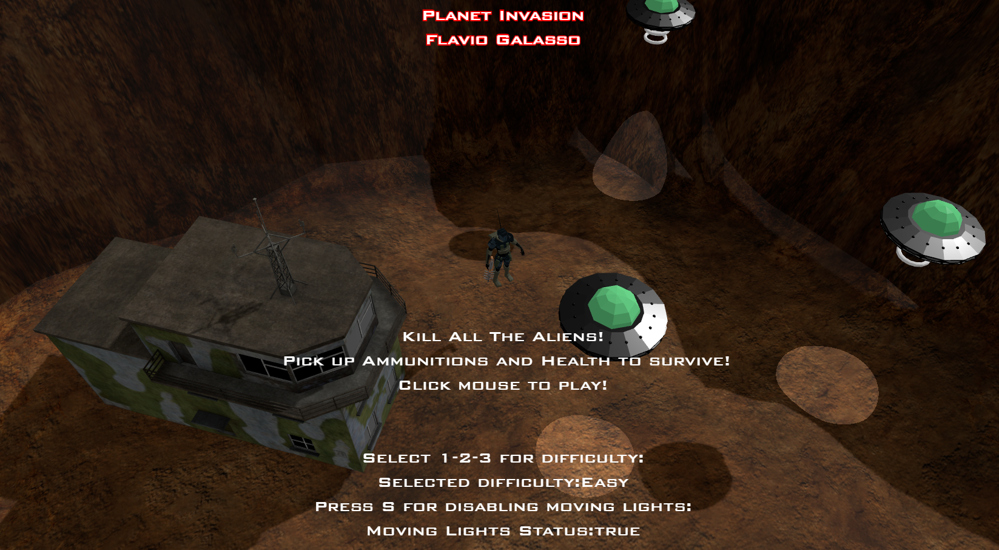
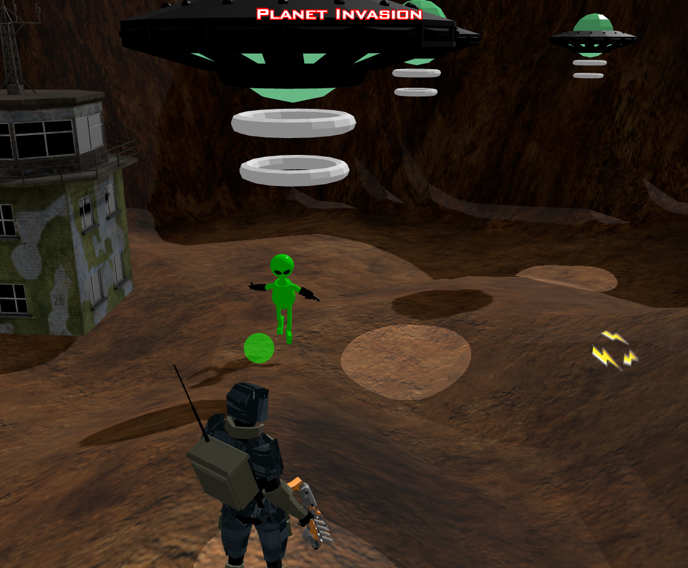

# Planet Invasion

## Flavio Galasso 2034377

16/07/2022

This is the **Offline-Version Repo!**, go to this link: [Planet Invasion](https://redmodder.github.io/planetinvasion.github.io/) for the online version, but beware: **be patient while the models load** and only **Google Chrome** is supported! 

## Introduction:

This is a Third-Person-Camera Mini-Game, built for the Interactive Graphics Course, set on a planet where there is a human base to defend against an alien invasion. The protagonist, a player-controlled robot, must withstand the waves of increasing difficulty by dodging shooting aliens and dodging their bullets. The player has a limited number of ammunition and health points at his disposal and, during the gameplay, it can recharge them by collecting the appropriate pickups.

The game is arcade-style, so it has an infinite gameplay with increasing difficulty as long as the player can stay alive.
